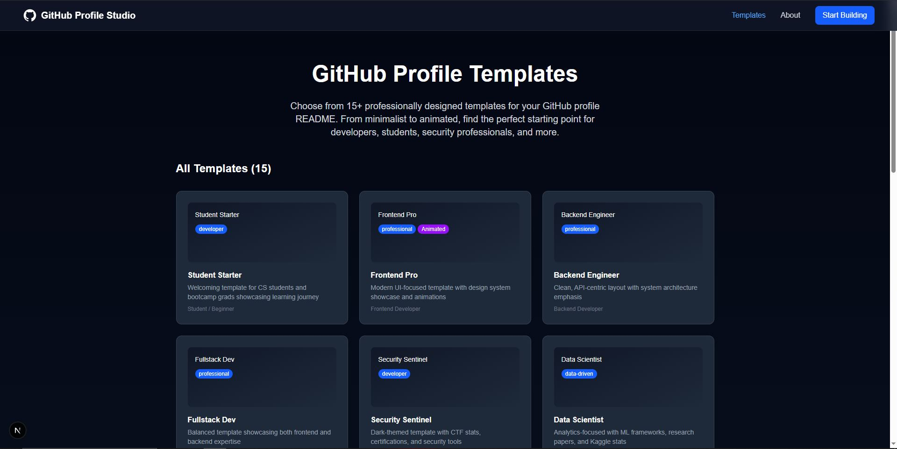
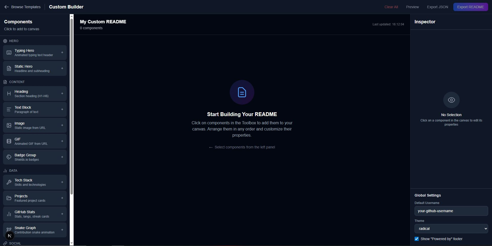

<div align="center">

<!-- Animated Header - Just like our tool generates! -->


<!-- Typing Animation - One of our key features! -->
<a href="https://git.io/typing-svg">
  
</a>

<br/>
<br/>

<!-- Tech Badges - Another feature we offer! -->
[](https://nextjs.org/)
[](https://www.typescriptlang.org/)
[](https://githubprofilestudio.vercel.app)

<br/>

### 🎯 Build Professional GitHub Profile READMEs in Minutes

**No sign-up • Completely free • Export with one click**

<br/>

[](https://githubprofilestudio.vercel.app/builder/custom)
&nbsp;&nbsp;
[](https://githubprofilestudio.vercel.app/templates)

</div>

---

## ✨ What Can You Create?

<table>
<tr>
<td width="50%">

### 🐍 Contribution Snake Animation
Generate animated snakes that eat your GitHub contributions!


</td>
<td width="50%">

### ⌨️ Typing Animations
Add dynamic typing effects to your profile hero section.


</td>
</tr>
<tr>
<td width="50%">

### 📊 GitHub Stats Cards
Showcase your GitHub activity with beautiful stat cards.


</td>
<td width="50%">

### 🔥 Streak Stats
Display your contribution streaks to show consistency.


</td>
</tr>
<tr>
<td width="50%">

### 💻 Top Languages
Show off your most-used programming languages.


</td>
<td width="50%">

### 🏆 GitHub Trophies
Display your GitHub achievements and milestones.


</td>
</tr>
</table>

---

## 🛠️ Tech Stack Badges

Create beautiful technology badges for your skills section - choose from **100+ technologies**:

<div align="center">


**...and 90+ more technologies available!**

</div>

---

## 🎨 15+ Beautiful Templates

Choose from professionally designed templates for every developer persona:

<div align="center">

| Template | Best For |
|:--------:|:---------|
| 🎓 **Student Starter** | CS students & bootcamp grads |
| 💼 **Fullstack Developer** | Backend + Frontend engineers |
| 🎨 **Frontend Pro** | UI/UX focused developers |
| 🔧 **Backend Engineer** | API & server-side specialists |
| 📊 **Data Scientist** | ML/AI practitioners |
| 🛡️ **Security Researcher** | Cybersecurity professionals |
| 📱 **Mobile Developer** | iOS/Android developers |
| ☁️ **DevOps Engineer** | Infrastructure & CI/CD experts |
| 🎮 **Game Developer** | Game dev enthusiasts |
| 🌐 **Open Source Contributor** | OSS maintainers |
| ✍️ **Technical Writer** | Documentation specialists |
| 🏢 **Tech Lead** | Engineering managers |

</div>

---

## 🌟 Key Features

<div align="center">

| Feature | Description |
|:-------:|:------------|
| 🎭 **15+ Templates** | Professionally designed, ready to use |
| ⌨️ **Typing Animations** | Dynamic text effects for your hero |
| 🐍 **Contribution Snake** | Animated snake eating your commits |
| 📊 **GitHub Stats** | Auto-generated stats, streaks & languages |
| 🛠️ **100+ Tech Badges** | Showcase your entire skill set |
| 📂 **Project Showcase** | Feature your best repositories |
| 🔗 **Social Links** | Connect all your profiles |
| 👁️ **Live Preview** | Real-time WYSIWYG editing |
| 🌓 **Theme Support** | Preview in light & dark mode |
| 📋 **One-Click Export** | Copy markdown instantly |
| 🔒 **No Sign-up** | Start building immediately |
| 💯 **100% Free** | No hidden costs, ever |

</div>

---

## 🚀 How It Works

<div align="center">

```
┌─────────────────┐    ┌─────────────────┐    ┌─────────────────┐    ┌─────────────────┐
│   1. Choose     │ → │   2. Customize  │ → │   3. Preview    │ → │   4. Export     │
│    Template     │    │    Content      │    │    Live         │    │    Markdown     │
└─────────────────┘    └─────────────────┘    └─────────────────┘    └─────────────────┘
```

**1.** Pick from 15+ templates or start blank  
**2.** Add your info, tech stack, projects & socials  
**3.** See real-time preview as you edit  
**4.** Export and paste into your GitHub profile  

</div>

---

## 📸 Screenshots

<div align="center">

### 🏠 Landing Page


### 🎨 Template Gallery


### 🛠️ Custom Builder


</div>

---

## 💡 Why GitHub Profile Studio?

<table>
<tr>
<td align="center" width="33%">

### ⚡ Fast
Build a complete profile in under 5 minutes

</td>
<td align="center" width="33%">

### 🎯 Easy
No coding knowledge required at all

</td>
<td align="center" width="33%">

### ✨ Beautiful
Professional designs that stand out

</td>
</tr>
</table>

---

## 🤝 Contributing

Found a bug or have a feature idea? We'd love to hear from you!

- 🐛 [Report a Bug](https://github.com/adityaverma9777/Github-ProfileStudio/issues/new?labels=bug&template=bug_report.md)
- 💡 [Request a Feature](https://github.com/adityaverma9777/Github-ProfileStudio/issues/new?labels=enhancement&template=feature_request.md)
- ⭐ Star this repo if you find it helpful!

---

## 💖 Support the Project

If you love GitHub Profile Studio, consider supporting its development:

<div align="center">

<a href="https://buymeacoffee.com/adityaverma9777">
  
</a>

<br/>
<br/>

[](https://buymeacoffee.com/adityaverma9777)

</div>

---

<div align="center">

<!-- Footer Wave - Matching our header! -->


**Made with ❤️ for the developer community**

[🚀 Start Building Your Profile Now](https://githubprofilestudio.vercel.app/builder/custom)

</div>
